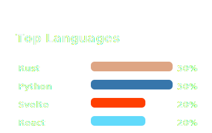

<h1 align="center">Hwan</h1>

<b>AI Researcher • Full-Stack Architect • Systems Leader</b>

### 👤 Introduce
I’m a full-stack developer bridging AI research, scalable infrastructure, and thoughtful front-end design. From AI prompt engineering to large-scale infrastructure, I design precise and reliable systems.

I’m not just someone who works with technology — I solve problems through reasoning. Code reflects structured thought, and every system embodies logic refined through clarity.

### 📊 Stats

  

  
  

